  <picture>
    <source media="(prefers-color-scheme: dark)" srcset="assets/banner-dark.svg">
    
  </picture>

## Building quietly

I build security operations as software. At a managed security service provider that means the whole stack in version control — the Azure platform, the detection content, the response automation — deployed by pipeline instead of assembled by hand. Rules get versioned, reviewed and released; they don't get clicked into a portal.

In the evenings I build the tooling I wished I'd had.

Local-first, always: your data stays on your hardware. I don't want your telemetry.

### What I'm building

**[IncidentCompanion](https://github.com/pureidle/IncidentCompanion)** — a self-hosted workspace for security incident investigation and root-cause analysis. Work the case, then the unglamorous half: customer RCA, and whichever of NIS2, DORA or GDPR applies. AGPL-3.0. In development.

### Elsewhere

[pureidle.dev](https://pureidle.dev/) · [LinkedIn](https://www.linkedin.com/in/bvansilfhout)
